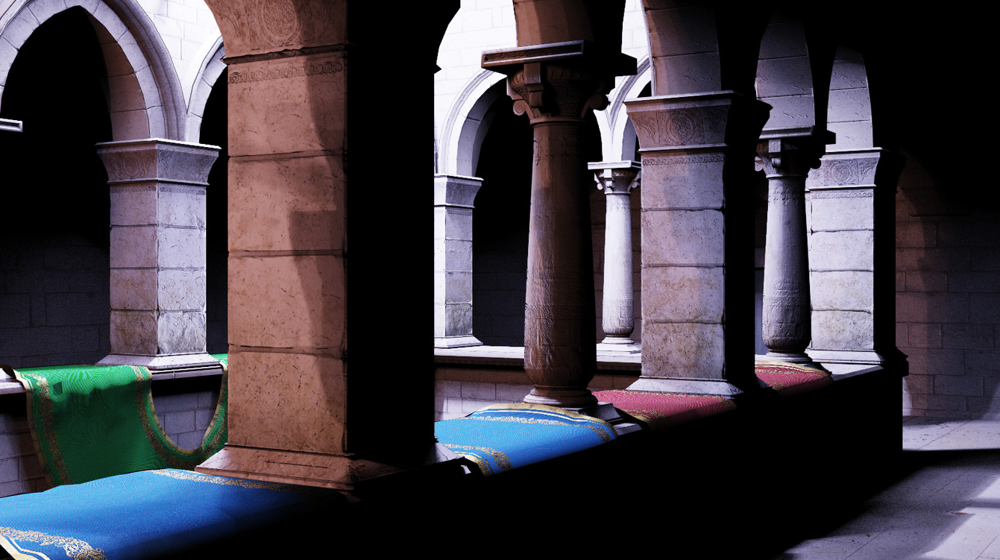

# eidola

**Real-time Global Illumination with Pure Ray Tracing**

**University of Pennsylvania, [CIS 565: GPU Programming and Architecture, Final Project ](https://cis565-fall-2022.github.io/)**

A Vulkan Real-time Ray Tracer with Texture-Driven Geometry based on [Vk Raytrace](https://github.com/nvpro-samples/vk_raytrace) by: 

**Chang Liu ([LinkedIn](https://www.linkedin.com/in/chang-liu-0451a6208/) | [Personal Website](https://hummawhite.github.io/)), Alex Fu ( [LinkedIn](https://www.linkedin.com/in/alex-fu-b47b67238/) |  [Personal Website](https://thecger.com/)) and Yilin Liu ( [LinkedIn](https://www.linkedin.com/in/yilin-liu-9538ba1a5/) |  [Personal Website](https://yilin.games/))**

**Tested on a personal laptop: i7-12700 @ 4.90GHz with 16GB RAM, RTX 3070 Ti Laptop 8GB**
  

## Features

- [ ] Direct Light Sampling with ReSTIR
- [ ] Global Illumination with ReSTIR
- [ ] Radiance Cache
- [ ] Displacement Map

## Presentations

- [*Pitch*](https://docs.google.com/presentation/d/1NLRpVT09ZlEVntIzB865NTc5noMcgNP8SMXB7Bp0KEk)

- [*Milestone 1*](https://docs.google.com/presentation/d/1NLRpVT09ZlEVntIzB865NTc5noMcgNP8SMXB7Bp0KEk/edit?usp=sharing)

- [*Milestone 2*](https://drive.google.com/file/d/1okQr6V4lZn3Exx-DBy-BUHfuLg3T9ZYt/view)

- [*Milestone 3*](#)

## Third Party Credit

### Assets

- [*GLTF Scene: Amazon Lumberyard Bistro*](https://developer.nvidia.com/orca/amazon-lumberyard-bistro)

- [*GLTF Scene: Crytek Sponza*](https://github.com/KhronosGroup/glTF-Sample-Models/blob/master/2.0/Sponza/glTF/Sponza.gltf)

### Referrences

- [Bitterli, Benedikt, et al. "Spatiotemporal reservoir resampling for real-time ray tracing with dynamic direct lighting." ACM Transactions on Graphics (TOG) 39.4 (2020): 148-1.](https://cs.dartmouth.edu/wjarosz/publications/bitterli20spatiotemporal.html)

-  [Daniel Wright. "Radiance Caching for Real-time Global Illumination." Advances in Real-Time Rendering in Games.SIGGRAPH 2021](https://advances.realtimerendering.com/s2021/index.html)

- [Kajiya Global Illumination Overview](https://github.com/EmbarkStudios/kajiya/blob/main/docs/gi-overview.md)

- [Ouyang, Yaobin, et al. "ReSTIR GI: Path Resampling for Real‐Time Path Tracing." Computer Graphics Forum. Vol. 40. No. 8. 2021.](https://research.nvidia.com/publication/2021-06_restir-gi-path-resampling-real-time-path-tracing)

- [Thonat, Theo, et al. "Tessellation-free displacement mapping for ray tracing." ACM Transactions on Graphics (TOG) 40.6 (2021): 1-16.](https://research.adobe.com/publication/tessellation-free-displacement-mapping-for-ray-tracing/#:~:text=Displacement%20mapping%20is%20a%20powerful,a%20significant%20amount%20of%20memory.)

