

    <h1>EIDOLA</h1>
    Real-time GI Path Tracer

**University of Pennsylvania, [CIS 565: GPU Programming and Architecture, Final Project ](https://cis565-fall-2022.github.io/)**

**Chang Liu ([LinkedIn](https://www.linkedin.com/in/chang-liu-0451a6208/) | [Personal Website](https://hummawhite.github.io/)), Alex Fu ( [LinkedIn](https://www.linkedin.com/in/alex-fu-b47b67238/) |  [Personal Website](https://thecger.com/)) and Yilin Liu ( [LinkedIn](https://www.linkedin.com/in/yilin-liu-9538ba1a5/) |  [Personal Website](https://yilin.games/))**

**Tested on a personal laptop: i7-12700 @ 4.90GHz with 16GB RAM, RTX 3070 Ti Laptop 8GB**

    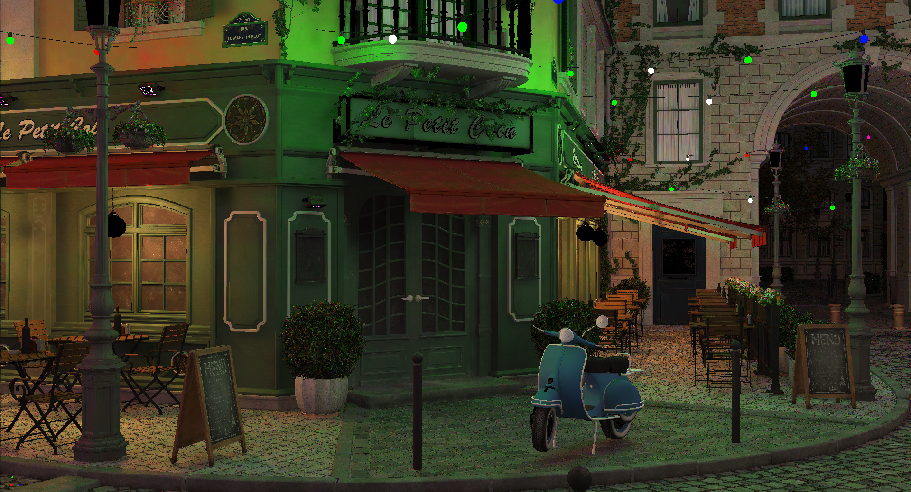
    
Bistro Exterior

     

    
    
Bistro Interior

     

## Introduction

This is the our final project for UPenn's CIS 565 GPU Architecture and Programming Course. Our motivation and goal is to explore the possibility of real-time global illumination majorly based on path tracing techniques. With one month of trial and effort, our renderer has been shaped into a real-time path tracer based on Vulkan RT and ReSTIR algorithms. In our renderer, we have implemented ReSTIR DI, ReSTIR GI and a denoiser.

## Features

- Real-time direct illumination based on ReSTIR DI

- Real-time indirect illumination based on ReSTIR GI

- Denoiser

- Tessellation Free Displacement Mapping (independent implementation on branch [displacement map]())

## Presentations

- [*Pitch*](https://docs.google.com/presentation/d/1NLRpVT09ZlEVntIzB865NTc5noMcgNP8SMXB7Bp0KEk)

- [*Milestone 1*](https://docs.google.com/presentation/d/1NLRpVT09ZlEVntIzB865NTc5noMcgNP8SMXB7Bp0KEk/edit?usp=sharing)

- [*Milestone 2*](https://drive.google.com/file/d/1okQr6V4lZn3Exx-DBy-BUHfuLg3T9ZYt/view)

- [*Milestone 3*](https://docs.google.com/presentation/d/1k-_qs0nqGj4rSUricp6cji-UP6j1BwNGTwsvqKBcDtw/edit?usp=sharing)

- [*Final Presentation*](https://docs.google.com/presentation/d/1rSwCd7MCO36SrICvODRKI74MOzRdcEi5Na1zm8pdN8A/edit?usp=sharing)

## Foundations of ReSTIR

#### Reservoir Sampling & Resampled Importance Sampling

Reservoir sampling is another discrete distribution sampling technique beside rejection sampling, CDF inversion and alias table. It allows a single sample to be drawn from multiple candidates at $O(1)$ memory cost. With reservoir sampling, all candidates do not have to be stored in memory at the same time, but they are serially put into a data structure called reservoir, which records the current chosen sample. Reservoirs can be merged easily, and  taking the sample from merged reservoirs is equivalent to perform sampling among samples from each merged reservoir.

Resampled Importance Sampling (RIS) can be regarded as an extension of importance sampling. For an estimator in Monte Carlo integration:
$$
I=\frac{1}{N}\sum\frac{f(X_i)}{p(X_i)}
$$
where $f$ is the function to be integrated, $p$ is the distribution to draw sample $X_i$. The more close $p$ to $f$, the less variant the estimator $I$. However, $f$ can be difficult to evaluate sometimes, like when it requires expensive intersection tests. RIS introduces another function $\hat{p}$, which is also an approximation of $f$ but a lot easier to evaluate (e.g., the unshadowed illuminance). Then we can first generate $M$ (a certain number) sample candidates $X_j$ from $p$, then pick one with respect to probability $\frac{\hat{p}(X_j)}{p(X_j)}$, with the estimator still unbiased. This process can just be done with reservoir sampling.

#### Spatiotemporal Reuse

In real-time ray tracing, the most important thing would probably be the number of samples. The more samples, the higher quality but at the cost of lower performance. Because reservoirs can be easily merged, reuse of samples among frames or in space is possible. If reservoirs are stored in screen space, then we can operate on them just as what we do in temporal anti-aliasing and filtering. We can find past reservoirs in previous frames using reprojection or take reservoirs from neighboring pixels. ReSTIR is right the algorithm doing this work. By combining reservoir reuse and RIS, ReSTIR, especially ReSTIR DI, is able to evaluate as much path contribution with only one intersection test.

## Pipeline

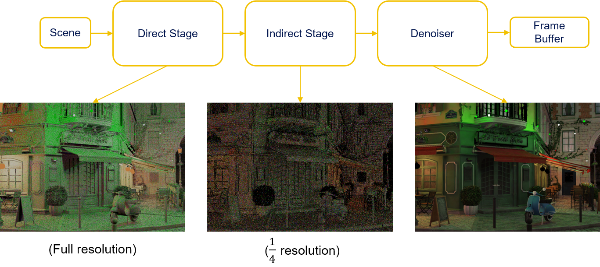

Our ray tracing pipeline can be divided to three main stages: direct stage, indirect stage and denoiser stage. In direct stage, the render generates G-Buffer, reservoirs for direct illumination and perform direct ReSTIR. In the second stage, we do path tracing to collect new indirect samples and evaluate indirect illumination. The last stage filters the result generate by previous stages and finally compose the noise-free output.

### Direct Stage

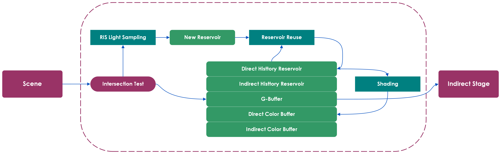

#### G-Buffer

All our ReSTIR and denoising process later require screen space geometry information, so we need to generate G-Buffer. By this time, our G-Buffer is generated along with direct reservoirs within the same first pass. To reduce bandwidth occupancy, our G-Buffer components are compressed with different techniques. Here is our G-Buffer layout:

    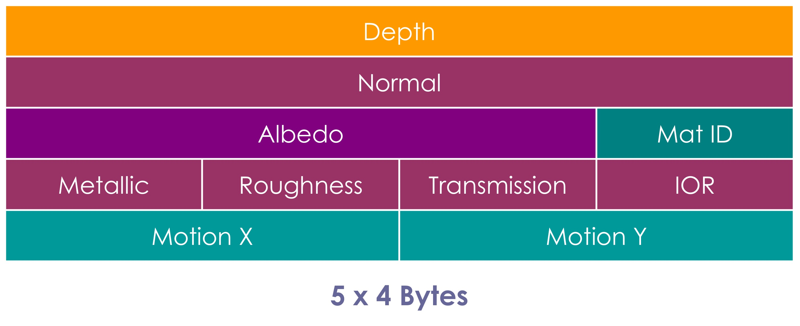

We keep the depth full 32 bit float for sufficient precision when used for indirect ReSTIR, and compress the rest that don't require much precision, such as albedo. For material ID, we hashed it to 8 bits. Also, out motion vector is stored as integer coordinates.

Compared to uncompressed layout, a total of 56 - 20 = 36 bytes is saved.

#### Direct ReSTIR

We implemented ReSTIR DI [[B. Bitterli et al., SIG 2020]]() for our direct illumination.

    
    
The effect of ReSTIR DI. From another CUDA program we developed to validate ReSTIR before we implemented it in this renderer

    
In our Vulkan renderer, in order to achieve real-time, we traded quality for speed

     

However, different from the original paper, we did several modifications to make it more suitable for real-time path tracing:

- First, we observed that, to maintain a relatively temporally stable output from ReSTIR, the number of RIS samples we sample in each ray tracing pass does not have to be very large (e.g., M = 32 in the paper). M = 4 is enough.
- Second, for reservoir clamping, we clamped the M of valid temporally neighboring reservoir to about 80x of current ones. This helps our direct illumination to quickly adapt to updated camera perspectives while keeping stable.
- Last, we decided not to use spatial resampling in our final implementation. This is mostly because spatial resampling is time consuming, and our implementation of didn't yield significant improvement in quality.  We'd rather use a spatial denoiser after temporal reuse.

### Indirect Stage

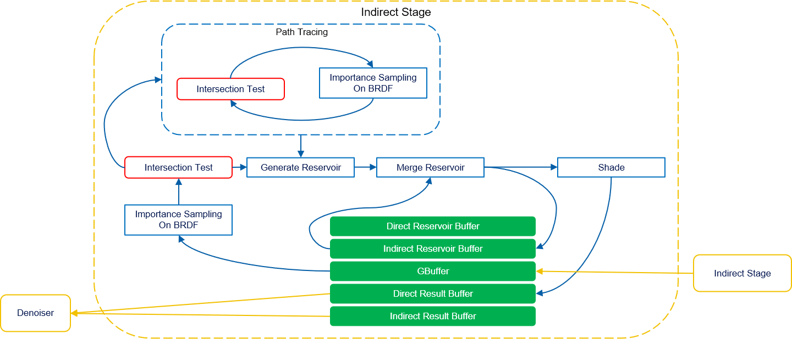

#### Indirect ReSTIR

For indirect illumination, we implemented ReSTIR GI [[S. Ouyang et al., HPG 2021]](). The input samples to indirect reservoir are generated by standard path tracing with Multiple Importance Sampling. Similar to DI, we did not use spatial resampling.

ReSTIR GI is different from DI when generating samples to put into reservoir. In ReSTIR DI, sampling a light path is simple, because once we get the first intersection point from camera we can pick a point on light source and connect it to the intersection point to evaluate $\hat{p}$ with no intersection test. This allows us to draw multiple samples and only do one intersection test for new generated reservoir. However for GI ReSTIR, to get a full light path we already need to find path vertices by intersection test.

| No ReSTIR                  | ReSTIR                       |
| -------------------------- | ---------------------------- |
| 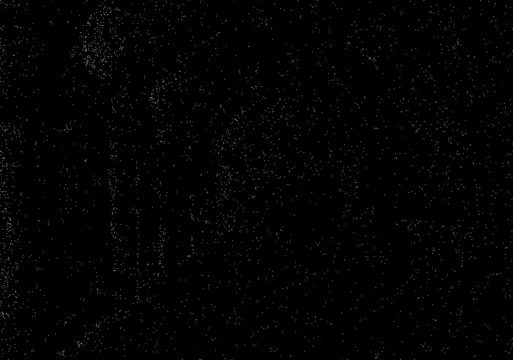 | 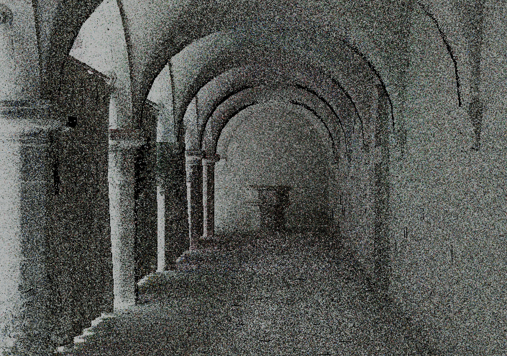 |

For indirect illumination, samples reuse greatly improves image quality, even if in each iteration we only add one sample to the reservoir.

#### Reduced Resolution & Tiled Long Paths

Based on the nature of tracing longer paths and perform more occlusion tests, we observed that tracing indirect lighting is much slower than direct. For example, before we optimized indirect lighting, running the Bistro Exterior scene takes 3.9 ms for direct and 25 ms for indirect.

Wasting time on tracing relatively insignificant component is not effective. Usually the variation of indirect illumination is at lower frequency based on the assumption that most surfaces in a scene are diffuse. With not so sharp variation, we could possibly trace less rays. In our path tracer, we reduce the resolution for indirect lighting to 1/4 of direct lighting. Later denoising for indirect lighting is also running at this resolution, greatly reducing denoising time.

Besides, we did as suggested in the ReSTIR GI paper, that to decide whether to trace longer paths with Russian roulette at block level. We only allow 25% of rays to trace multiple bounces, while the rest 75% trace one bounce.

### Denoise

#### A Lightweight Edge-Avoiding A-Trous Filter

In both ReSTIR DI and GI we have already included reuse of temporally neighboring samples, which gives us pretty decent temporally stable results. Therefore when it comes to denoising, we don't necessarily need a spatiotemporal denoiser like SVGF, not to say that temporally reused outputs from ReSTIR are correlated and prone to artifacts if denoised temporally.

Just like what we did in project 4, our denoising process is logically divided into three stages: demodulation, filtering and remodulation. We let the output from ReSTIR to be divided by screen-space albedo (this can be a simple trick by setting surface albedo to 1), and do tone mapping to compress radiance values into a range that denoiser can handle well.

The direct and indirect components are filtered separately and merged after filtering. For direct we use a 4 level wavelet since it's already smooth. For indirect, we use a 5 level wavelet to reduce flickering. Also, in case of large radiance values that are hard to be filtered, we do tone mapping before filtering and tone map back after filtering.

|          | Demodulated Input     | Denoised + Remodulated  |
| -------- | --------------------- | ----------------------- |
| Direct   |  |  |
| Indirect | 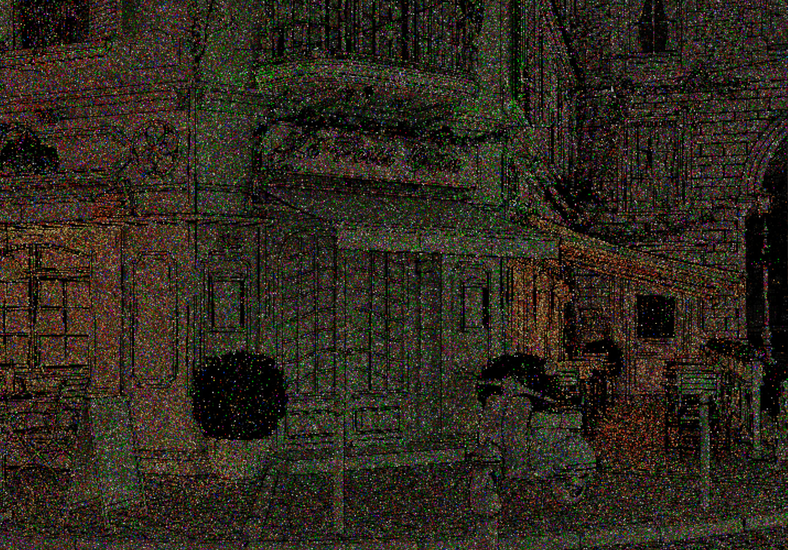 | 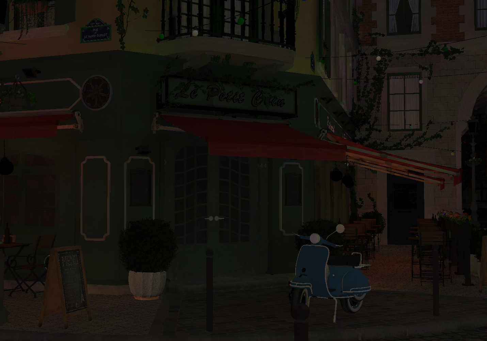 |
| Combined | 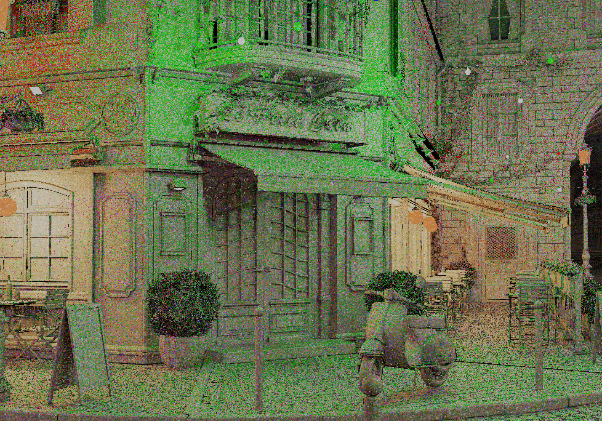 | 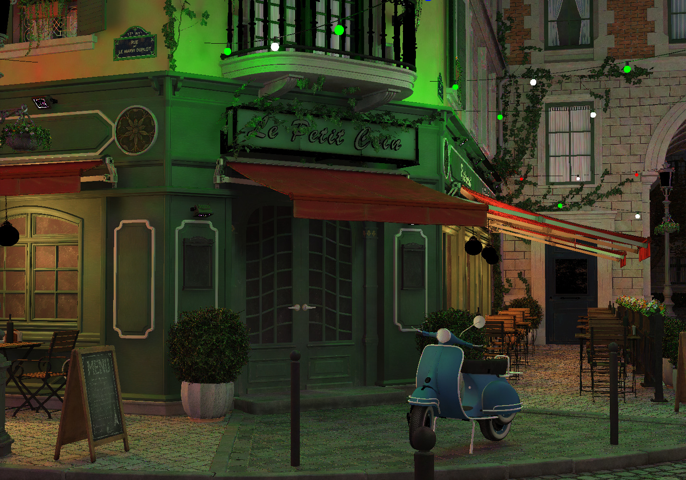 |

By the time we finished this project, we also tried bilateral filter, which only takes one pass. It turned out this filter worked well with direct illumination with faster speed but at the cost of lower quality.

## Performance

We tested our path tracer under 1920x1080, with indirect tracing depth = 4 for three scenes. Here is our result:

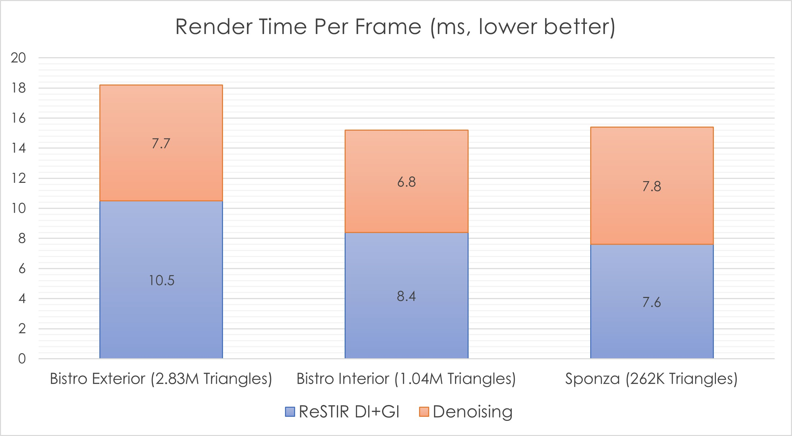

From the figure, our path tracer is able to render large scene (such as Bistro Exterior, which has 2.83 million triangles) within 20 ms (~50 FPS), efficient within our expectation. However, the denoiser takes about 8 ms, which is still a point to optimize.

## Conclusion

## Future Work

Even if we managed to implement so such features, our project is far from perfect. There is still long way to go to make it close to production level. Here we've came up with ideas to improve our path tracer.

### More Efficient Sampling Architecture

After ReSTIR DI, [*Rearchitecting Spatiotemporal Resampling for Production* [C. Wymann et al, HPG 2021]](https://research.nvidia.com/publication/2021-07_rearchitecting-spatiotemporal-resampling-production) tried to improve. It points out, the bottleneck of the original resampling algorithm lies in sampling of light sources, which relies on the use of alias table. Although alias table has the advantage of $O(1)$ sampling, its memory pattern is not friendly for parallel ray tracing process. Wymann et al. rearchitected sampling by 

### Unified ReSTIR PT Framework (GRIS)

Our work is currently based on earlier ReSTIR papers from 2020 and 2021. Actually, there has been a recent new research on ReSTIR, the [*Generalized Resampled Importance Sampling* [D. Lin et al, SIG 2022]](https://graphics.cs.utah.edu/research/projects/gris/), which extends ReSTIR DI from $L(S|D)E$ to full paths (NOTE: different from simply combining ReSTIR DI and ReSTIR GI). GRIS has 

We are looking forward to implementing this in our path tracer.

### Better Denoiser

For this project, we did not have much time for denoiser implementation. The A-Trous filter we chose worked just fine, but still not much to our satisfactory.

For example, it is likely to produce overly blurred indirect image because it treats all filter points as having the same spatiotemporal variance. As we know, the better SVGF algorithm uses variance to drive A-Trous kernel during filtering. So is it possible to derive an estimator of variance from the process of ReSTIR? This would be an interesting topic to work on.

Besides, Nvidia has a post about a denoiser specially designed to fit in the features of ReSTIR, the [*ReLAX*](https://www.nvidia.com/en-us/on-demand/session/gtcspring21-s32759/) denoiser which derives from SVGF, but delicately modified to handle correlated patterns introduced by spatiotemporal reuse.

### Displacement Mapping

We wanted Tessellation Free Displacement Mapping to work with our ReSTIR PTGI to produce gorgeous frames with great detail and we knew the novelty of its idea. However, since it wasn't able to utilize current RTX pipeline well, it would bring huge performance gap to our ReSTIR pipeline. Therefore, we only implemented it as a separate feature. In the future, when more customized acceleration structure/shaders are allowed in RTX pipeline, it will make a difference.

## Third Party Credit

### Base Code

- [*Vk_Raytrace*](https://github.com/nvpro-samples/vk_raytrace)

### Assets

- [*GLTF Scene: Amazon Lumberyard Bistro*](https://developer.nvidia.com/orca/amazon-lumberyard-bistro)

- [*GLTF Scene: Crytek Sponza*](https://github.com/KhronosGroup/glTF-Sample-Models/blob/master/2.0/Sponza/glTF/Sponza.gltf)

### Referrences

- [Bitterli, Benedikt, et al. "Spatiotemporal reservoir resampling for real-time ray tracing with dynamic direct lighting." ACM Transactions on Graphics (TOG) 39.4 (2020): 148-1.](https://cs.dartmouth.edu/wjarosz/publications/bitterli20spatiotemporal.html)

-  [Daniel Wright. "Radiance Caching for Real-time Global Illumination." Advances in Real-Time Rendering in Games.SIGGRAPH 2021](https://advances.realtimerendering.com/s2021/index.html)

- [Kajiya Global Illumination Overview](https://github.com/EmbarkStudios/kajiya/blob/main/docs/gi-overview.md)

- [Ouyang, Yaobin, et al. "ReSTIR GI: Path Resampling for Real‐Time Path Tracing." Computer Graphics Forum. Vol. 40. No. 8. 2021.](https://research.nvidia.com/publication/2021-06_restir-gi-path-resampling-real-time-path-tracing)

- [Thonat, Theo, et al. "Tessellation-free displacement mapping for ray tracing." ACM Transactions on Graphics (TOG) 40.6 (2021): 1-16.](https://research.adobe.com/publication/tessellation-free-displacement-mapping-for-ray-tracing/#:~:text=Displacement%20mapping%20is%20a%20powerful,a%20significant%20amount%20of%20memory.)
